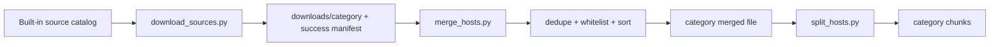

# ace-hosts

> **Disclaimer:** This repository — including all scripts, tests, and
> documentation — was fully developed by AI language models (LLMs). It has
> been reviewed and verified with automated tests and a type checker, but it
> should be treated accordingly. Please report any issues you find.

**Category-specific DNS blocklists for distracting and addictive websites, rebuilt monthly.**

`ace-hosts` downloads, normalizes, merges, deduplicates and splits upstream
host/domain lists into ready-to-use hosts files. It started as a successor to
the maintenance tooling of the deleted
[`columndeeply/hosts`](https://github.com/columndeeply/hosts) adult blocklist,
but now builds independent lists for:

- **adult** — pornography / NSFW sites
- **gaming** — online games, gaming portals and major gaming services
- **social** — social networks and major social/messaging platforms
- **gambling** — betting, casinos and gambling sites
- **streaming** — video/audio streaming and entertainment services
- **dating** — dating and matchmaking sites
- **shopping** — online shopping and commerce sites

The categories stay separate end-to-end: sources download into
`downloads/<category>/`, each merge consumes only that category's successful
source manifest, and each release asset has an unambiguous category name.

The historical adult asset names are intentionally preserved for Ace Blocker
compatibility: `merged_hosts.txt`, `hosts00`, `hosts01`, ... remain the adult
list. New categories use `<category>.txt` and `<category>-hosts00`,
`<category>-hosts01`, ... .

## Features

- **Seven behavioural categories** with a central source catalog in
  `scripts/source_catalog.py`.
- **Format-tolerant parsing** for classic hosts files, bare domains, Adblock
  syntax (`||domain^`), wildcards, URLs, inline comments, BOMs and CRLF.
- **Atomic downloads and outputs** — a failed refresh cannot leave a partial
  source file that is consumed by the next merge.
- **Stale-source protection** — each download writes a manifest of sources that
  succeeded during that run; automatic merging follows the manifest rather
  than blindly merging old files left in the directory.
- **Whitelist support** via `whitelist.txt`.
- **Deterministic output** through deduplication and sorting.
- **GitHub-friendly chunks** below 90 MiB by default, with repeated headers so
  every chunk is independently usable.
- **Deterministic environment** through exact direct dependency pins and the
  committed `uv.lock`.

## Requirements

- [uv](https://docs.astral.sh/uv/)
- Python 3.10+

## Setup

```bash
git clone https://github.com/Linea-Software/ace-hosts
cd ace-hosts
uv sync
```

## Quick start

Build every category:

```bash
uv run python scripts/download_sources.py --all-categories
uv run python scripts/merge_hosts.py --all-categories --split
```

Or build one category:

```bash
uv run python scripts/download_sources.py --category gaming
uv run python scripts/merge_hosts.py --category gaming --split
```

The default remains `adult`, so the original commands still work:

```bash
uv run python scripts/download_sources.py
uv run python scripts/merge_hosts.py --split
```

Installed console commands are equivalent:

```bash
ace-hosts-download --all-categories
ace-hosts-merge --all-categories --split
ace-hosts-split --check
```

Typical output:

```text
hosts/
├── merged_hosts.txt       # adult, legacy-compatible name
├── hosts00                # adult chunks
├── hosts01
├── gaming.txt
├── gaming-hosts00
├── social.txt
├── social-hosts00
├── gambling.txt
├── gambling-hosts00
├── streaming.txt
├── streaming-hosts00
├── dating.txt
├── dating-hosts00
├── shopping.txt
├── shopping-hosts00
└── sha256_checksums.txt   # release workflow
```

The number of chunks depends on the current upstream data.

## Pipeline



## CLI

### `download_sources.py`

| Flag | Description |
| --- | --- |
| `--category NAME` | Download one built-in category; default `adult` |
| `--all-categories` | Download all built-in categories |
| `--sources LIST` | Override sources for one category with comma/newline-separated URLs or `name=url` entries |
| `--output-dir PATH` | Base raw-download directory; category subdirectories are created below it |
| `--dry-run` | Print selected sources without downloading |
| `--no-rate-limit` | Skip the delay between upstream requests |

`--sources`/`SOURCES` is intentionally single-category only. Custom source
names are sanitized before they are used as local filenames.

### `merge_hosts.py`

| Flag | Description |
| --- | --- |
| `--category NAME` | Merge one category; default `adult` |
| `--all-categories` | Merge every built-in category |
| `--input PATH` | Explicit input file/glob, repeatable; single-category mode only |
| `--output PATH` | Explicit merged output; single-category mode only |
| `--whitelist PATH` | Domains to exclude |
| `--no-dedupe` | Keep duplicates |
| `--no-sort` | Preserve merge order |
| `--normalize-ip IP` | Hosts-file IP prefix; default `127.0.0.1` |
| `--split` | Split the merged output after writing it |
| `--split-mb MIB` | Maximum chunk size; default `90` |
| `--split-prefix NAME` | Override chunk prefix; single-category mode only |
| `--no-progress` | Disable progress bars |

Automatic input selection prefers the downloader's success manifest. For
backward compatibility, the adult category also accepts the old flat
`downloads/*` layout if `downloads/adult/` does not exist yet.

### `split_hosts.py`

| Flag | Description |
| --- | --- |
| `--input PATH` | Merged file to split; default `hosts/merged_hosts.txt` |
| `--output-dir PATH` | Chunk output directory |
| `--max-mb MIB` | Maximum chunk size |
| `--prefix NAME` | Chunk prefix |
| `--check` | Verify existing numeric-suffix chunks instead of splitting |
| `--no-progress` | Disable progress bars |

Splitting first stages the complete new chunk set in a temporary directory,
then publishes it and removes stale numeric chunks from older builds. Chunk
size accounting includes the complete per-chunk header, including chunk
numbers wider than two digits.

## Built-in categories and sources

The catalog intentionally targets **behavioural/distraction blocking**, not a
generic malware/ad/tracker filter. Broad security lists are therefore not
mixed into these categories.

| Category | Built-in sources |
| --- | --- |
| adult | StevenBlack `porn-only`; Block List Project porn; 4skinSkywalker Anti-Porn; tiuxo porn; saskuu porno; StbanMc CommunityBlocklists porn; zangadoprojets Pornpages; HaGeZi NSFW; Sinfonietta pornography; chadmayfield porn; Energized Porn |
| gaming | UT1 `games`; Block List Project Fortnite |
| social | StevenBlack `social-only`; UT1 `social_networks`; Block List Project Facebook, TikTok, Twitter/X and WhatsApp |
| gambling | Block List Project gambling; StevenBlack `gambling-only`; UT1 `gambling` |
| streaming | UT1 `audio-video`; Block List Project YouTube |
| dating | UT1 `dating` |
| shopping | UT1 `shopping` |

Exact raw URLs, source homepages and license labels live in
[`scripts/source_catalog.py`](scripts/source_catalog.py), making source changes
reviewable in one place. The monthly job tolerates an individual dead source,
but fails if no selected source succeeds.

### Source families

- **UT1 / Université Toulouse Capitole** provides categorized domain data for
  games, gambling, social networks, audio/video, dating and shopping. The
  project publishes the data under CC BY-SA 4.0; `ace-hosts` consumes the daily
  GitHub mirror maintained by `olbat/ut1-blacklists`.
- **Block List Project** supplies dedicated category/service lists including
  porn, gambling, Facebook, TikTok, Twitter/X, WhatsApp, YouTube and Fortnite.
- **StevenBlack/hosts** supplies separate extension-only lists for porn, social
  and gambling. `ace-hosts` deliberately uses those category-only variants —
  not StevenBlack's general adware/malware base list.
- The adult category retains several additional specialist sources to preserve
  the coverage of the original project.

## Licensing of generated data

The **ace-hosts source code** in this repository is MIT-licensed. Generated
blocklist data is assembled from third-party datasets and is **not made MIT by
this repository's code license**. Upstream license and attribution/share-alike
obligations remain relevant to redistributed generated data.

Generated headers record the distinct source-license labels for built-in
categories. In particular, UT1 data is CC BY-SA 4.0, Block List Project is
published under the Unlicense, and other adult/StevenBlack sources have their
own upstream terms. Treat the labels as maintenance metadata and verify the
upstream repositories when making licensing decisions.

## Configuration

All keys are optional and may be supplied through `.env` or the environment.

| Key | Default | Description |
| --- | --- | --- |
| `SOURCES` | *(built-in category sources)* | Custom sources for one category |
| `DOWNLOAD_DIR` | `downloads` | Base raw-download directory |
| `OUTPUT_DIR` | `hosts` | Merged/chunk output directory |
| `MERGED_FILENAME` | `merged_hosts.txt` | Legacy adult merged filename |
| `WHITELIST_FILE` | `whitelist.txt` | Domains excluded from merges |
| `INPUT_FILES` | *(empty)* | Explicit single-category inputs/globs |
| `SPLIT_CHUNK_MB` | `90` | Chunk size in MiB |
| `SPLIT_PREFIX` | `hosts` | Legacy adult chunk prefix |
| `REMOVE_DUPLICATES` | `true` | Deduplicate domains |
| `SORT_OUTPUT` | `true` | Sort output |
| `NORMALIZE_IP` | `127.0.0.1` | Hosts-file IP prefix |
| `REQUEST_TIMEOUT` | `30` | Per-request timeout in seconds |
| `RETRIES` | `3` | Retries per source |
| `RETRY_BACKOFF` | `2.0` | Exponential-backoff base |
| `RATE_LIMIT_DELAY` | `1.0` | Delay between source downloads |
| `USER_AGENT` | `ace-hosts/0.1` | Download User-Agent |
| `LOG_LEVEL` | `INFO` | Logging level |

## Releases

The GitHub `Release` workflow runs on the first day of every month at 03:00
UTC. It downloads all categories, rebuilds the merged files/chunks, creates
`sha256_checksums.txt`, and publishes every output under a `vYYYY.MM.DD` tag.

Adult compatibility URLs remain stable:

```text
https://github.com/Linea-Software/ace-hosts/releases/latest/download/merged_hosts.txt
https://github.com/Linea-Software/ace-hosts/releases/latest/download/hosts00
https://github.com/Linea-Software/ace-hosts/releases/latest/download/hosts01
```

New categories follow the same pattern, for example:

```text
https://github.com/Linea-Software/ace-hosts/releases/latest/download/gaming.txt
https://github.com/Linea-Software/ace-hosts/releases/latest/download/gaming-hosts00
https://github.com/Linea-Software/ace-hosts/releases/latest/download/social.txt
https://github.com/Linea-Software/ace-hosts/releases/latest/download/gambling.txt
```

## Development

```bash
uv sync
uv run pytest
uv run basedpyright
uv run python -m compileall scripts tests
```

Tests never require network access. Source URL health is a maintenance concern,
not a unit-test dependency.

## Contributing

- **False positives / missing domains:** open an issue or PR.
- **New category/source:** edit `scripts/source_catalog.py` and document the
  upstream license/homepage.
- **Whitelist:** add safe active domains to `whitelist.txt`.
- **Generated files:** do not edit `hosts/*` or `downloads/*` by hand.

## License

MIT for the repository's own source code — see [LICENSE](LICENSE). Third-party
blocklist data retains its upstream licensing terms; see the licensing section
above and the source catalog.

**Credits:** the original adult-list maintenance approach derives from the
archived `columndeeply/hosts` project. Category data is provided by the
respective upstream maintainers listed above.
