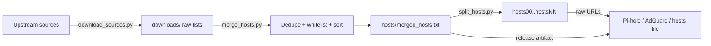

# ace-hosts

> **Disclaimer:** This repository — including all scripts, tests, and
documentation — was fully developed by AI language models (LLMs). It has
been reviewed and verified with automated tests and a type checker, but it
should be treated accordingly. Please report any issues you find.

**Download, merge, deduplicate and split host lists for DNS-based blocking.**

`ace-hosts` is an automated Python pipeline that produces a unified, cleaned
blocklist from many upstream sources — the same approach as the now deleted
[`columndeeply/hosts`](https://github.com/columndeeply/hosts)
repository (a merged adult-content blocklist of more than 10 million domains,
split into 90 MB GitHub-friendly chunks named `hosts00`, `hosts01`, ...).

Instead of shell scripts, this project uses three small Python scripts with
logging, retries, progress bars and atomic writes:

| Script | Replaces | What it does |
| --- | --- | --- |
| `scripts/download_sources.py` | (manual fetching) | Downloads host lists from multiple upstream sources with retries and rate limiting |
| `scripts/merge_hosts.py` | `cleanup.sh` + `merger.sh` | Cleans each list (comments, whitespace, IP normalization), merges, deduplicates, applies the whitelist, sorts, and optionally splits |
| `scripts/split_hosts.py` | (split step of `merger.sh`) | Splits the merged file into `<90 MB` chunks named `hosts00`, `hosts01`, ... |

The output works with Pi-hole, AdGuard Home, Technitium DNS, DNS66, Daedalus,
or directly as a system `hosts` file.

## Features

- **Format-tolerant parsing** — handles `0.0.0.0`/`127.0.0.1`/`::1` hosts
  lines, bare domain lists, adblock syntax (`||domain^`), wildcards
  (`*.domain`), inline comments, trailing dots, BOMs and CRLF.
- **Graceful failures** — per-source retries with exponential backoff; a
  source that keeps failing is skipped, not fatal.
- **Whitelist support** — exclude domains from the merged list
  (`whitelist.txt`, same idea as the original repo's `whitelist/` directory).
- **GitHub-friendly output** — chunks stay below 90 MB by default (GitHub's
  hard limit is 100 MB) and each chunk carries the header comments, so every
  chunk works standalone.
- **Deterministic builds** — pinned direct dependencies + `uv.lock`.

## Requirements

- [uv](https://docs.astral.sh/uv/) (0.4+; developed against 0.11)
- Python 3.10+

## Installation

```bash
# Initialize the project (uv-managed)
uv init ace-hosts
cd ace-hosts

# Add dependencies with explicit versions
uv add requests==2.31.0
uv add httpx==0.25.0
uv add tqdm==4.66.1
uv add python-dotenv==1.0.0

# Create the environment and install the project + dev dependencies
uv sync

# Alternatively, install it into any environment (classic editable install)
uv pip install -e .
```

`uv sync` reads `pyproject.toml` and `uv.lock`, creates `.venv/`, and installs
the project plus its console scripts (`ace-hosts-download`, `ace-hosts-merge`,
`ace-hosts-split`). The lockfile is committed, so every contributor gets the
exact same dependency set.

## Quick start

```bash
# 1. Download the source lists into downloads/
uv run python scripts/download_sources.py

# 2. Merge, deduplicate, sort — and split into <90MB chunks
uv run python scripts/merge_hosts.py --split
```

Result:

```
hosts/
├── merged_hosts.txt   # single-file merged list (also on the releases page)
├── hosts00            # ≤90 MB, usable standalone
├── hosts01
└── ...
```

Using the installed commands is equivalent:

```bash
ace-hosts-download
ace-hosts-merge --split
ace-hosts-split --check   # verify chunk sizes afterwards
```

### Pipeline



## Usage

### `download_sources.py` — fetch the sources

| Flag | Description |
| --- | --- |
| `--sources` | Override sources: bare URLs or `name=url`, comma/newline separated |
| `--output-dir` | Where raw downloads go (default `downloads/`) |
| `--dry-run` | Print the source list and exit |
| `--no-rate-limit` | Skip the politeness delay between sources |

### `merge_hosts.py` — clean, merge, deduplicate

| Flag | Description |
| --- | --- |
| `--input PATH` | Input file or glob (repeatable). Default: `INPUT_FILES` env var, else everything in `downloads/` |
| `--output PATH` | Merged output file (default `hosts/merged_hosts.txt`) |
| `--whitelist PATH` | File with domains to exclude (default `whitelist.txt`) |
| `--no-dedupe` | Keep duplicate domains |
| `--no-sort` | Keep insertion order |
| `--normalize-ip IP` | IP prefix for every line (default `127.0.0.1`) |
| `--split` | Split the merged file into chunks afterwards |
| `--split-mb MIB` | Max chunk size (default `90`) |
| `--split-prefix NAME` | Chunk prefix (default `hosts`) |

### `split_hosts.py` — split into GitHub-friendly chunks

| Flag | Description |
| --- | --- |
| `--input PATH` | Merged file to split (default `hosts/merged_hosts.txt`) |
| `--output-dir PATH` | Where chunks are written (default: input's directory) |
| `--max-mb MIB` | Max chunk size (default `90`) |
| `--prefix NAME` | Chunk prefix (default `hosts`) |
| `--check` | Verify existing chunks instead of splitting |

Chunks are named `hosts00`, `hosts01`, ... (zero-padded; grows to three
digits past 99 chunks). Lines are never split across chunks, and each chunk
starts with the header comments so it can be served directly as a blocklist
URL.

## Configuration

Copy `.env.example` to `.env` and adjust. All keys are optional.

| Key | Default | Description |
| --- | --- | --- |
| `SOURCES` | *(built-in list)* | Comma/newline separated `name=url` or bare URLs |
| `DOWNLOAD_DIR` | `downloads` | Raw download directory |
| `OUTPUT_DIR` | `hosts` | Merged output / chunks directory |
| `MERGED_FILENAME` | `merged_hosts.txt` | Name of the merged file |
| `WHITELIST_FILE` | `whitelist.txt` | Domains excluded from the merge |
| `INPUT_FILES` | *(empty)* | Comma-separated files/globs to merge instead of `downloads/` |
| `SPLIT_CHUNK_MB` | `90` | Max chunk size in MiB |
| `SPLIT_PREFIX` | `hosts` | Chunk filename prefix |
| `REMOVE_DUPLICATES` | `true` | Deduplicate domains |
| `SORT_OUTPUT` | `true` | Sort the merged list |
| `NORMALIZE_IP` | `127.0.0.1` | IP prefix for merged lines |
| `STRIP_COMMENTS` | `true` | Strip comments and blank lines |
| `REQUEST_TIMEOUT` | `30` | Per-request timeout (seconds) |
| `RETRIES` | `3` | Retries per source |
| `RETRY_BACKOFF` | `2.0` | Backoff base (`backoff * 2^attempt`) |
| `RATE_LIMIT_DELAY` | `1.0` | Delay between sources (seconds) |
| `USER_AGENT` | `ace-hosts/0.1` | User-Agent for downloads |
| `LOG_LEVEL` | `INFO` | `DEBUG` / `INFO` / `WARNING` / `ERROR` |

## Default sources

The built-in list mirrors the sources used by the original
[`columndeeply/hosts`](https://github.com/columndeeply/hosts) repo
(StevenBlack, blocklistproject, cbuijs, RPiList, ...). Set `SOURCES` in `.env`
(or pass `--sources`) to customize:

| Name | URL |
| --- | --- |
| stevenblack | https://raw.githubusercontent.com/StevenBlack/hosts/master/hosts |
| blocklistproject-porn | https://raw.githubusercontent.com/blocklistproject/Lists/master/porn.txt |
| cbuijs-porn | https://raw.githubusercontent.com/cbuijs/shallalist/master/porn/domains |
| 4skinskywalker | https://raw.githubusercontent.com/4skinSkywalker/Anti-Porn-HOSTS-File/master/HOSTS.txt |
| rplist-porn | https://raw.githubusercontent.com/RPiList/specials/master/BlocklistLists/Porn.txt |
| sinfonietta-porn | https://raw.githubusercontent.com/Sinfonietta/hostfiles/master/porn-hosts |
| tiuxo-porn | https://raw.githubusercontent.com/tiuxo/hosts/master/porn |
| saskuu-porno | https://raw.githubusercontent.com/saskuu/blocklist/main/porno.txt |
| purify-porn | https://raw.githubusercontent.com/CyberPurifyAI/purify/main/Filters/filter/porn/m.txt |

Sources go stale — the downloader skips failures gracefully, and PRs updating
this table are welcome.

## Using the output

### Pi-hole / AdGuard Home / Technitium DNS

Add each chunk as a blocklist (the header comment on every chunk makes it
valid standalone):

```
https://raw.githubusercontent.com/<you>/ace-hosts/main/hosts00
https://raw.githubusercontent.com/<you>/ace-hosts/main/hosts01
...
```

### hosts file

- **Windows** — append the lines to `C:\Windows\System32\drivers\etc\hosts`
  (administrator privileges required).
- **Linux / macOS** — append to `/etc/hosts`:
  `cat hosts0X >> /etc/hosts`
- **Android** — use a DNS-based blocker (DNS66, personalDNSfilter, Daedalus)
  and add the chunk URLs above.

## Updating

Run the pipeline on a schedule (e.g. monthly, like the original repo):

```bash
uv run python scripts/download_sources.py
uv run python scripts/merge_hosts.py --split
```

Then commit `hosts/hosts*` (or attach `merged_hosts.txt` to a release) and
bump the version tag. A GitHub Actions workflow can automate this with a cron
trigger; see `.github/workflows/ci.yml` for the test side.

## Development

```bash
uv sync --dev     # install including dev dependencies
uv run pytest     # run the test suite
```

The tests cover format parsing, whitelist filtering, deduplication and the
split guarantees (naming, size limit, line integrity) without touching the
network.

## Contributing

- **Domain suggestions / false positives** — open an issue. If you have more
  than a couple dozen domains, submit a PR.
- **New sources** — PR the URL into `scripts/download_sources.py` (and the
  README table), with a link to the source's page.
- **Whitelist** — add safe, active domains to `whitelist.txt`. Do not
  whitelist dead domains: they may come back. Only whitelist domains that
  point to a non-blocked site.
- **Generated files** — please do not edit `hosts/*` directly; they are
  generated by the pipeline. Changes belong in sources, `whitelist.txt`, or a
  PR to the scripts.

## License

MIT — see [LICENSE](LICENSE).

**Credits:** this project derives from, and is a reimplementation of, the
[`columndeeply/hosts`](https://github.com/columndeeply/hosts) repository
(archived at
https://web.archive.org/web/20260217031549/https://github.com/columndeeply/hosts),
which is licensed under the MIT License. The source lists it aggregates are
the work of their respective maintainers — see the sources table above.
